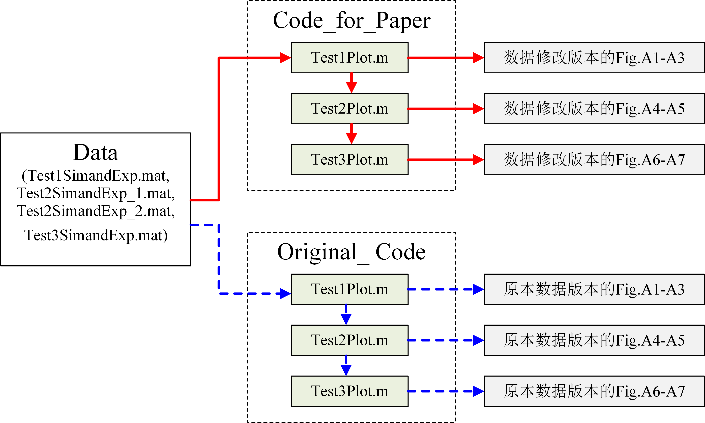

# SVID算法文章代码验证步骤（SVIDAlgorithm article code verification steps）
<figure>
   
  
  <figcaption>
  </figcaption>
     
</figure>

## Step 01 环境准备 Environment Preparation
* 需要安装Matlab
* Need to install Matlab
## Step 02 下载代码 Download the code
* 将`Code_for_Paper`和`Original_Code`两个文件夹拉取到本地。
* Pull the two folders `Code_for_Paper` and `Original_Code` to your local computer.
## Step 03 下载数据 Download data
* 由于Github对上传文件大小有限制，我将会用到的数据存在云端，可以通过[链接](https://1drv.ms/f/s!AvR41SoNKXKfgmuvXyLk87ziHJ-N?e=Y6uiw8)进行下载，里面应该含有`Test1SimandExp.mat`、`Test2SimandExp_1.mat`、`Test2SimandExp_2.mat`和`Test3SimandExp.mat`四个文件。检查无误后将其分别复制到下载好的`Code_for_Paper`和`Original_Code`文件夹中。
* Since Github has a limit on the size of uploaded files, the data I will use is stored in the cloud and can be downloaded through [link](https://1drv.ms/f/s!AvR41SoNKXKfgmuvXyLk87ziHJ-N?e=Y6uiw8), which should contain four files: `Test1SimandExp.mat`, `Test2SimandExp_1.mat`, `Test2SimandExp_2.mat`, and `Test3SimandExp.mat`. After checking that they are correct, copy them to the downloaded `Code_for_Paper` and `Original_Code` folders respectively.
## Step 04 运行论文所使用代码 Run the code used in the paper
* 在Matlab环境中运行`Code_for_Paper`文件夹中`Test1Plot.m`即可获得数据修改版本的Fig.A1-A3,运行``Test2Plot.m`即可获得数据修改版本的Fig.A4-A5,运行``Test3Plot.m`即可获得数据修改版本的Fig.A6-A7
* Run `Test1Plot.m` in the `Code_for_Paper` folder in the Matlab environment to get the modified version of Fig.A1-A3, run ``Test2Plot.m` to get the modified version of Fig.A4-A5, run ``Test3Plot.m` to get the modified version of Fig.A6-A7,

## Step 05 运行原始代码 Run the original code
* 在Matlab环境中运行`Original_Code`文件夹中`Test1Plot.m`即可获得原本数据版本的Fig.A1-A3,运行``Test2Plot.m`即可获得原本数据版本的Fig.A4-A5,运行``Test3Plot.m`即可获得原本数据版本的Fig.A6-A7,
* Run `Test1Plot.m` in the `Original_Code` folder in the Matlab environment to get the original data version of Fig.A1-A3, run ``Test2Plot.m` to get the original data version of Fig.A4-A5, run ``Test3Plot.m` to get the original data version of Fig.A6-A7,

## Step 06 对比分析 Comparative analysis
* 比较两者结果差异，验证“学术不端行为”的有效性。
* Compare the differences between the two results to verify the effectiveness of "academic misconduct".
## Step 07 一点技巧 A little trick
* 细心的同学可能发现得到的图和论文中的图在尺寸和线条颜色上有不同，那是因为我担心被导师发现，先在matlab中弄好数据放缩后，将数据导入到其他画图软件，例如Origin里面重新绘图，这样导师就不可能发现了。
* Careful people  may find that the obtained figures are different from those in the paper in size and line color. That’s because I was worried that my supervisor would find out, so I first scaled the data in Matlab, and then imported the data into other drawing software, such as Origin, and re-drew the figure. This way, my supervisor would not be able to find out.
