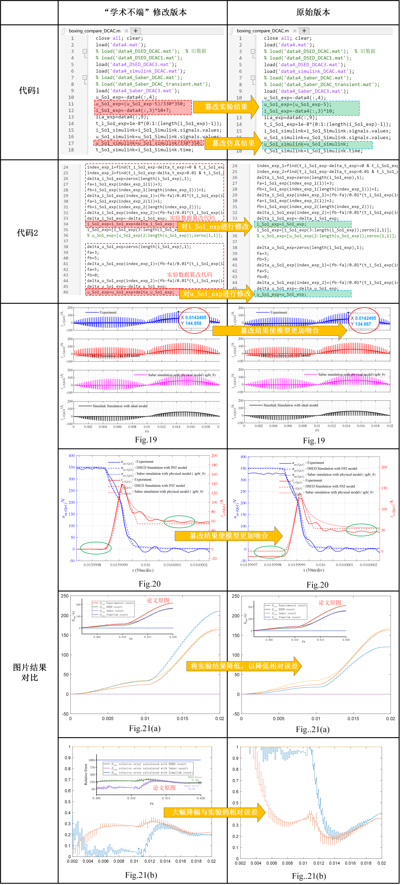
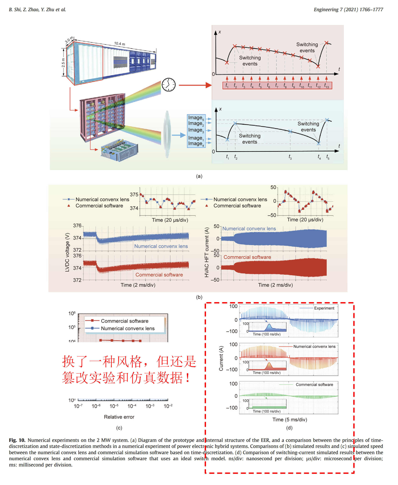
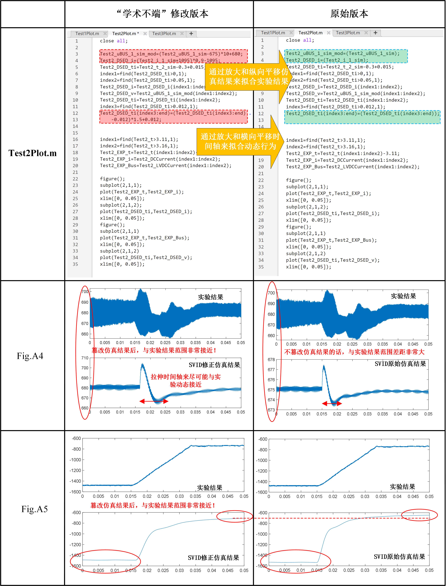
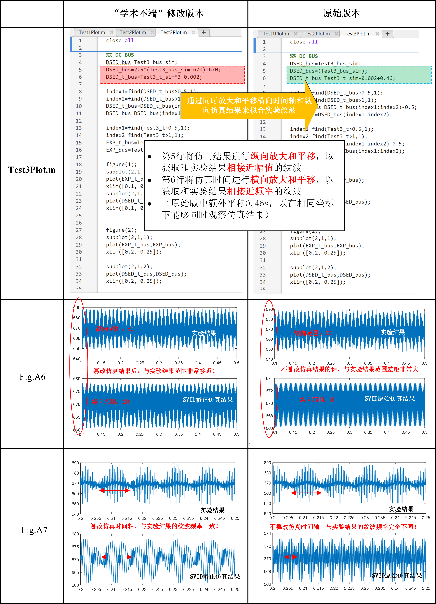
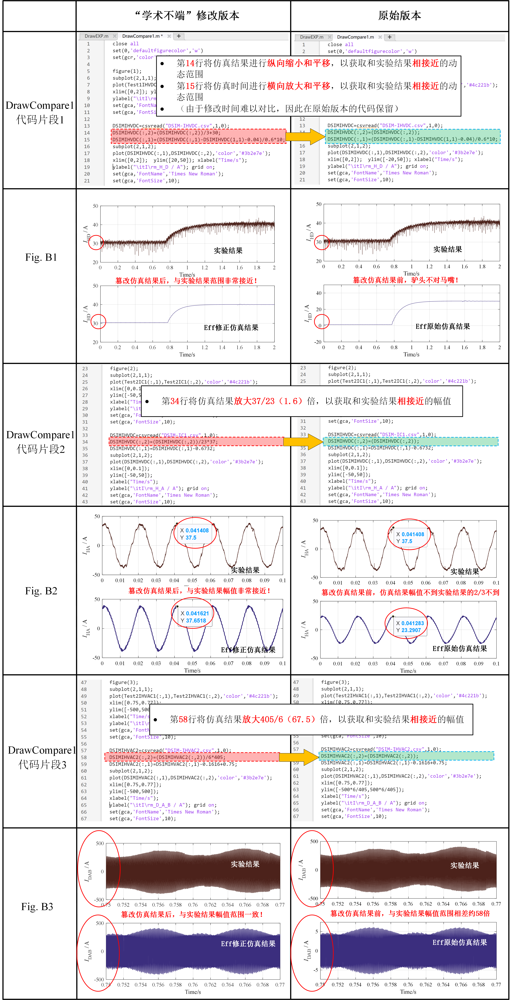
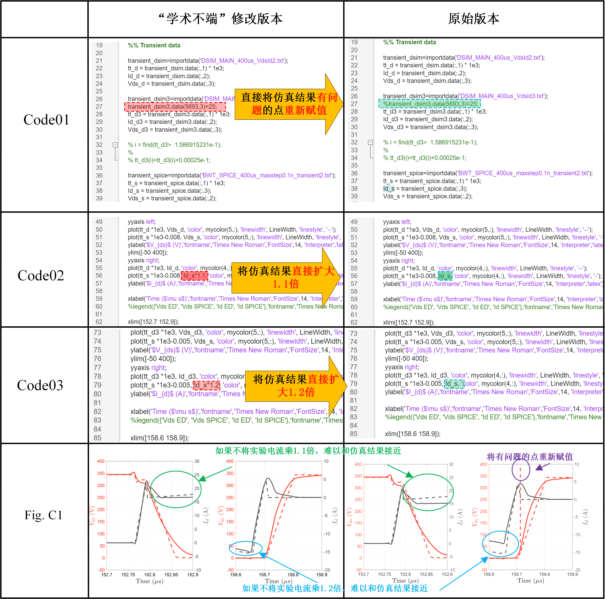
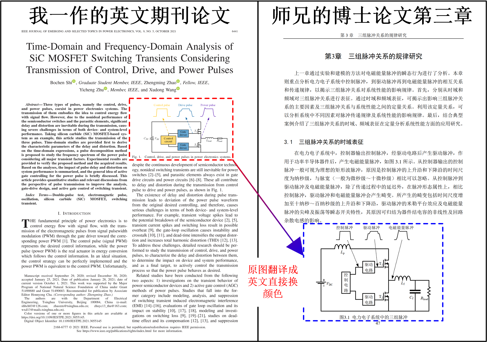
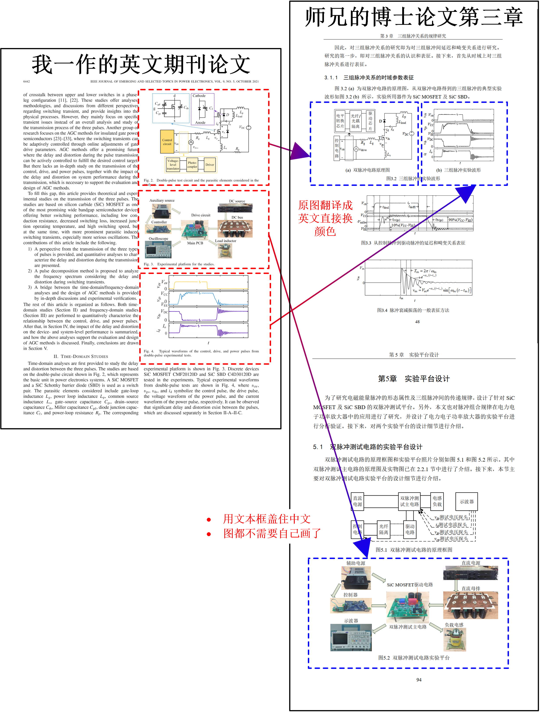
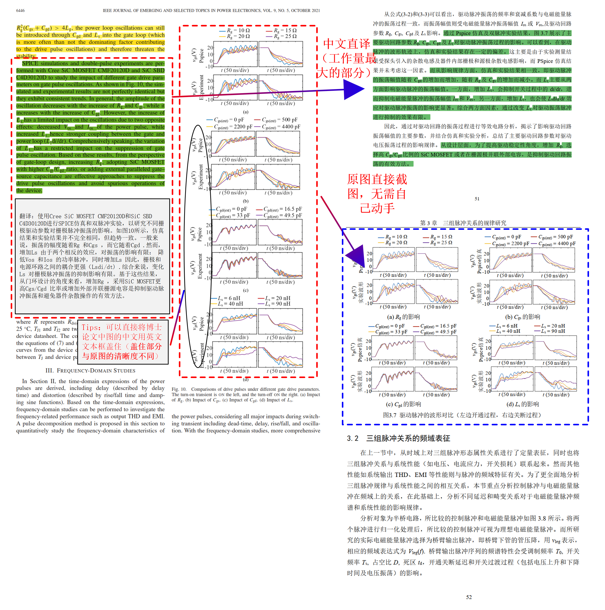
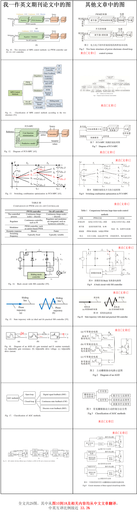

# 个人简介
大家好，我是施b辰，博士，清华大学“水木学者”，国家级人才计划青年拔尖人才（**29岁获得，中国历史上最年轻**），于清华大学电机工程与应用电子技术系获得学士和博士学位。主要研究方向为电力电子混杂系统动力学表征、多尺度建模仿真及其工业软件。详细介绍可以在[此处](http://www.eiri.tsinghua.edu.cn/yjry/All/e0b2e2d285e246bd9f56f047be9af30d.htm)找到。视频介绍可以在[这里](https://vimeo.com/946340773?share=copy)找到，本教程的电子版pdf可通过https://github.com/ShiArthur03 找到。
## 学术成就
**主持**国家重点研发计划“电机装备与系统多时间尺度工业仿真软件”2023YFB3307000（**清华大学首位博士后主持**）、国家自然科学基金青年基金、中国博士后科学基金2022M721776等项目，参与国家自然科学基金重大项目、联合重点项目、“十三五”国家重点研发计划“智能电网技术与装备”重点专项等。发表SCI/EI论文40余篇（其中代表性著作见 [Publication](https://github.com/ShiArthur03/ShiArthur03/tree/main/06_Publication)），获授权中国发明专利10余项、美国发明专利2项。担任IEEE电力电子学会（PELS）中国区会员委员会秘书长、会员发展工作委员会委员、IEEE SYPS等多个国际学术会议技术委员会主席、组织委员会主席、分会场主席等。
## 个人荣誉
获教育部科技进步一等奖（**排名2**）、日内瓦国际发明展评审团特别金奖（**排名2**）、中国机械工业科学技术二等奖、IEEE PELS P3 Talk Award、国际大电网委员会CIGRE Thesis Award(**首位中国学生获得**)、英国工程技术学会 IET Postgraduate Research Award(**首位中国学生获得**)、北京市优秀博士学位论文、中国电工技术学会优秀博士学位论文、清华大学优秀博士学位论文、清华大学研究生特等奖学金、清华大学“学术新秀”、清华大学优秀博士后、清华大学优秀共产党员等荣誉奖项。
## 商业推广
担任[迪盛迅达（北京）科技有限公司](https://aiqicha.baidu.com/company_detail_30569654382795?tab=certRecord)**CTO(首席技术官)**，主要负责首款自主化和世界首套基于状态离散的电力电子工业仿真软件[DSIM](https://www.dsimtechnology.com/sy)。如果有兴趣加入我们团队的可以点击[这里](https://www.dsimtechnology.com/gzjh)获取更多信息。
# 自我陈述
我做这个网站分享的**初衷**就是，看到周围大部分人都是老老实实，勤勤恳恳的搞科研，我真的是痛心疾首，这样子怎么可能快速的产出成果和获得荣誉呢？我作为中国**最年轻**的青拔人才，我觉得我有资格，也有必要来告诉大家如何在科研道路中**弯道超车**。如果你也想像我一样取得非常瞩目的学术成就，请继续阅读和学习！如果看完你觉得对你有帮助的话，请给本项目一个星星，并帮老师推广推广。同时我也开通了[讨论区](https://github.com/ShiArthur03/ShiArthur03/discussions)，欢迎大家向我提问。
## 01修炼心法
作为一名本土培养的博士，如果按照现有聘用规章制度，我**最好**的结果就是以助理研究员的身份留校，例如[郭宏业](https://www.eea.tsinghua.edu.cn/faculties/hyguo.htm), [蔺晨晖](https://www.eea.tsinghua.edu.cn/info/1069/5538.htm)等人。但是我不甘心，我太想进步了，于是我便通过**篡改数据**，**窃取研究成果**，中英文“**一稿两投**”等“**学术不端**”的方法快速积累学术成果。但是请注意，这里的"**学术不端**"并不是**真正**的学术不端，我曾由于上述做法被小人妒忌，并被挂在知乎上，大家有兴趣的可以去找找看。但是身正不怕影子斜，我没有受到任何处理，还能继续获得青拔人才帽子，这也侧面反映出我的方法是**完全符合**[清华大学学术道德规范](https://www.tsinghua.edu.cn/xswyh/info/1018/1019.htm),不满足[清华大学预防与处理学术不端行为办法](https://www.tsinghua.edu.cn/xswyh/info/1018/1018.htm)的使用条件，所以大家可以放心效仿。
## 02潜龙在渊
通过这种“**学术不端**”的方式，我可以很轻松的快速发表多篇SCI论文，与此同时其他人还在用愚笨的方法科研。于是**在非常显著的论文成果优势下，我有充足的时间利用这些论文和抢夺其他人的成果来帮助我申请各种奖项**，包括[国际大电网委员会CIGRE Thesis Award](https://mp.weixin.qq.com/s/YKzITY2B9f-G9sWyMnYKkQ)、[英国工程技术学会 IET Postgraduate Research Award](https://mp.weixin.qq.com/s/khM4l8Cnce8oNYmaQS4Rew)，IEEE PELS P3 Talk Award、日内瓦国际发明展评审团特别金奖等国际大奖。然后用奖套奖，进一步扩大优势，先后申请并获得了[清华大学“学术新秀”](https://mp.weixin.qq.com/s/6cDpomicYfe7JNdMyVoGKA)、[清华大学研究生特等奖学金](https://mp.weixin.qq.com/s/GGJLRtNbR9nY5M4hXatzXQ)、清华大学“水木学者”、北京市优秀博士学位论文、中国电工技术学会优秀博士学位论文、[清华大学优秀博士学位论文](https://mp.weixin.qq.com/s/nf2qT4JOMSLQKrAdwvXRog)，教育部科技进步一等奖和中国机械工业科学技术二等奖等荣誉奖项。
## 03成名之路
到这里，我通过修炼“学术不端”的心法，并通过一定时间的积累，**取得了同龄人五年乃至十年都难以取得的成就**，于是我在29岁就顺利获得国家级人才计划**青年拔尖人才**，是中国有史以来最年轻的青拔！我很骄傲，也很自豪，凭借以上成果，我当选清华能源互联网创新研究院——大容量电力电子与新型电力传输研究中心电力电子仿真研究室主任，先后成功申请到了国家自然科学基金青年基金、中国博士后科学基金，并再次打破常规，首次以**博士后身份**成为国家重点研发计划课题负责人，实现又一大跨越。由于我这些**远超同龄人**的成就，毋庸置疑我要比[郭宏业](https://www.eea.tsinghua.edu.cn/faculties/hyguo.htm), [蔺晨晖](https://www.eea.tsinghua.edu.cn/info/1069/5538.htm)等凡夫俗子们要更优秀，能够被破格提拔，以助理教授的身份留校任职。后面我将继续进行“学术不端”行为，用最快速度从助理教授到教授，争取在三十五岁之前获得杰青头衔，40岁之前当上院士，早日当上清华大学校长，带领整个学校取得更大的成就。
# 将学术不端发扬光大
今天，我想以老师的身份向你们分享我自己科研成功的真正秘诀，避免你们走弯路。如果我是一个精致利己的人的话，我本来可以什么都不说，这对我来说是最好的。但想到你们会像其他人一样，像驴一样埋头苦干，我实在有点不忍心，还是决定教教大家怎么通过“学术不端”来玩转学术圈。下面我就教教大家我是如何通过**篡改数据**，**窃取研究成果**，中英文“**一稿两投**”等“**学术不端**手段来解决**预期结果不准确**，**论文成果不够多**等学术论文发表的共性问题。希望大家能够真正的有所收获！ 
另外，为了大家能够更好地理解，我将以我的代表性SCI论文为例，同时也是申请上述奖项和荣誉的支撑性材料，来阐述我的“学术不端”方法。由于篇幅有限，我将重点指出我在每篇论文中最具代表性的“学术不端行为”，并将相应的代码共享给大家，以便大家更好的理解和实践！每篇文章所使用代码都没存放在对应文章名字的仓库中，其中包括两个文件夹，一个是我在论文中实际进行“学术不端”的代码(`Code_for_Paper`)，另一个是不进行“学术不端”前原本的代码(`Original_Code`)。所谓“纸上得来终觉浅”，希望大家有精力的情况下，将代码下载下来，自己走一遍，体会一下“学术不端”的快乐。 
此外，我还想提醒一下，最好像我一样自己偷偷的使用，不要被导师和同门发现，以避免不必要的麻烦。同时，使用上述方法所引起的一切后果由使用者自行承担，与本人没有任何关系。
## 01 PAT模型文章（Top期刊TPEL）
这篇文章是我最早的一篇代表作，也是我整个研究的基础。论文全称 Piecewise Analytical Transient Model for Power Switching Device Commutation Unit，主要是提出了一种针对功率半导体器件的分段解析模型，论文全文可通过点击[链接](https://ieeexplore.ieee.org/document/8449982)获得。
### 问题概述
我在这篇论文中主要遇到了**预期结果不准确**的问题，因为大家知道，功率半导体开关的建模涉及众多半导体物理知识，像国际先进的Pspice、LTspice等器件仿真软件也只能通过求解强耦合的一组偏微分方程来获得结果，这样的结果非常准确，但缺点就是仿真速度特别慢。为了能够让他仿得快，于是我提出一种PAT模型，将功率半导体开关的动作分成几个阶段，每一段只用简单的解析表达式来计算。由于缺乏对底层机理的考虑，所以不可避免地会出现PAT模型的结果与实验结果不符的情况。在这种情况下，如果我直接将上述结果放在论文中，这毫无疑问会被拒稿。被拒稿则会严重影响我的研究进度，甚至还不得不更改研究方向，那这样我将很难留校了。于是我开发了一种数据放缩的方法，以实验结果为标杆，通过对PAT模型的数据进行合理的修改，从而让PAT模型的结果与实验结果能够得到高度的一致。 
下面我将以论文中的Fig.19-21为例，来详细说明代码修改的地方，并将修改前后的结果进行对比。详细的数据处理代码和验证流程可以在[Code_for_PAT_Model](https://github.com/ShiArthur03/ShiArthur03/tree/main/01_Code_for_PAT_Model)中找到。
<figure>
   
  
  <figcaption>
  </figcaption>
     
</figure>

### 解决效果
通过以上努力，我成功根除了PAT模型不准确的底层问题。进一步地，通过专业绘图软件将matlab中处理后的数据画出，展示在[TPE文章](https://ieeexplore.ieee.org/document/8449982)Fig.19, [Numerical Convex Lens](https://www.sciencedirect.com/science/article/pii/S2095809921003441) Fig.10(d)和我的博士论文中。
<figure>
   
  
  <figcaption>
  </figcaption>
     
</figure>
<figure>
   
  
  <figcaption>
  </figcaption>
     
</figure>

### 小结
综上我在这篇文章中存在以下问题：  
在[清华大学预防与处理学术不端行为办法](https://www.tsinghua.edu.cn/xswyh/info/1018/1018.htm)中：
*第二十二条  在科学研究及相关活动中有下列行为之一的，应当**认定为构成学术不端行为**：
（三）**伪造科研数据**、资料、文献、注释，或者捏造事实、编造虚假研究成果；

## 02 SVID算法文章（Top期刊TIE）
这篇文章是我第二个代表作，论文全称 Discrete State Event-Driven Simulation Approach With a State-Variable-Interfaced Decoupling Strategy for Large-Scale Power Electronics Systems，主要是提出了一种针对大规模系统的解耦积分算法，论文全文可通过点击[链接](https://ieeexplore.ieee.org/document/9301371)获得。
### 问题概述
为了凸显能够仿真大规模系统的特点，我选择了实验室其他人研发的兆瓦级电力电子变压器作为研究对象，将他们的实验波形拿来使用。但是在仿真中我遇到仿真结果与实验结果不匹配的问题，如果直接将仿真结果与实验结果的对比放在论文上，那么显著的差异会让审稿人立刻拒掉我的文章，为此，我开发了将纵轴，即仿真数据轴，与横轴，即仿真时间轴，同时进行平移，放大，缩小等操作，从而实现修改后的仿真结果和实验结果能够高度吻合。 
下面我将以论文中的Fig.11作为例子，来详细说明代码修改的地方，并将修改前后的结果进行对比。详细的数据处理代码和验证流程可以在[Code_for_SVID](https://github.com/ShiArthur03/ShiArthur03/tree/main/02_Code_for_SVID)中找到。
<figure>
   
  
  <figcaption>
  </figcaption>
     
</figure>
<figure>
   
  
  <figcaption>
  </figcaption>
      
</figure>
<figure>
   
  
  <figcaption>
  </figcaption>
      
</figure>

### 解决效果
通过以上努力，我彻底解决了SVID仿真结果与实验结果不一致的底层问题。进一步地，通过专业绘图软件将matlab中处理后的数据画出，其中Fig.A1-A2以及Fig.A6-A7展示在[期刊论文](https://ieeexplore.ieee.org/document/8449982)的Fig11中，并将Fig.A1-A7展示在我的博士论文中。
<figure>
   
  
  <figcaption>
  </figcaption>
      
</figure>

### 小结
综上我在这篇文章中存在以下问题：  
在[清华大学预防与处理学术不端行为办法](https://www.tsinghua.edu.cn/xswyh/info/1018/1018.htm)中： 
*第二十二条  在科学研究及相关活动中有下列行为之一的，应当**认定为构成学术不端行为**： 
（三）**伪造科研数据**、资料、文献、注释，或者捏造事实、编造虚假研究成果； 

## 03 Eff应用文章（Top期刊TIE）
这篇文章是我第三个代表作，论文全称 Switching Transient Simulation and System Efficiency Evaluation of Megawatt Power Electronics Converter With Discrete State Event-Driven Approach，主要是介绍使用DSED方法来计算兆瓦级变换器的运行效率，论文全文可通过点击[链接](https://ieeexplore.ieee.org/document/9381002)获得。

### 问题概述
为了能够计算兆瓦级变换器的损耗，我首先需要在论文中证明我的仿真结果和实验结果一致，因此我需要将仿真波形与实际波形作比较，如论文中的Fig.15所示。但是在仿真中我遇到仿真结果与实验结果不匹配的问题，如果直接将仿真结果与实验结果的对比放在论文上，那么显著的差异会让审稿人立刻拒掉我的文章，为此，我开发了将纵轴，即仿真数据轴，与横轴，即仿真时间轴，同时进行平移，放大，缩小等操作，此外我还新增了直接使用数学函数来捏造仿真结果的新举措，从而实现修改后的仿真结果和实验结果能够高度吻合。 
下面我将以论文中的Fig.15作为例子，来详细说明代码修改的地方，并将修改前后的结果进行对比。详细的数据处理代码和验证流程可以在[Code_for_Eff](https://github.com/ShiArthur03/ShiArthur03/tree/main/03_Code_for_Eff)中找到。
<figure>
   
  
  <figcaption>
  </figcaption>
     
</figure>
<figure>
   
  
  <figcaption>
  </figcaption>
      
</figure>
<figure>
   
  
  <figcaption>
  </figcaption>
      
</figure>

### 解决效果
通过以上努力，我彻底解决了损耗计算中仿真结果与实验结果不一致的底层问题。进一步地，通过专业绘图软件将matlab中处理后的数据画出，其中Fig.B1-B8分别对应[期刊论文](https://ieeexplore.ieee.org/document/9381002)的Fig.15的(a)-(5)中，同时将其也写在我的博士论文中。
<figure>
   
  
  <figcaption>
  </figcaption>
      
</figure>

### 小结
综上我在这篇文章中存在以下问题：  
在[清华大学预防与处理学术不端行为办法](https://www.tsinghua.edu.cn/xswyh/info/1018/1018.htm)中： 
*第二十二条  在科学研究及相关活动中有下列行为之一的，应当**认定为构成学术不端行为**： 
（三）**伪造科研数据**、资料、文献、注释，或者捏造事实、编造虚假研究成果； 

## 04 THSA应用文章（Q2期刊TCAS-1）
除了上述三个代表作外，为了快速不费力地能够有更多的论文，我选择通过更换算例来水论文，例如这篇论文，Event-Driven Approach With Time-Scale Hierarchical Automaton for Switching Transient Simulation of SiC-Based High-Frequency Converter，是将上述的PAT模型重新应用在一个新的系统上，论文全文可通过点击[链接](https://ieeexplore.ieee.org/document/9523592)获得。

### 问题概述
通过对上述三篇核心支撑文章的讲解后，大家不难看出，我的PAT模型和仿真结果要想和实验对得上，只能依靠篡改实验数据。所以这篇文章也不例外，为了将PAT模型和其他结果相吻合，我当然也对仿真数据进行了“捏造和篡改”。我相信大家通过上述三篇文章已经基本掌握了篡改数据的方法，那么为了节约篇幅，下面我只展示这篇文章一个图的“学术不端流程”，以凸显我进行“学术不端”的广泛性。 
下面我将以论文中的Fig. 10(f-g)图作为例子，来详细说明代码修改的地方，并将修改前后的结果进行对比。详细的数据处理代码和验证流程可以在[Code_for_THSA](https://github.com/ShiArthur03/ShiArthur03/tree/main/04_Code_for_TSHA)中找到。
<figure>
   
  
  <figcaption>
  </figcaption>
     
</figure>

### 解决效果
通过以上努力，我彻底解决了损耗计算中仿真结果与实验结果不一致的底层问题。进一步地，通过专业绘图软件将matlab中处理后的数据画出，Fig.C1对应[期刊论文](https://ieeexplore.ieee.org/document/9523592)的Fig. 10(f-g)中，同时将其也写在我的博士论文中。
<figure>
   
  
  <figcaption>
  </figcaption>
      
</figure>

### 小结
综上我在这篇文章中存在以下问题：  
在[清华大学预防与处理学术不端行为办法](https://www.tsinghua.edu.cn/xswyh/info/1018/1018.htm)中： 
*第二十二条  在科学研究及相关活动中有下列行为之一的，应当**认定为构成学术不端行为**： 
（三）**伪造科研数据**、资料、文献、注释，或者捏造事实、编造虚假研究成果； 

## 05 三组脉冲文章（Q1期刊JESTPE）
### 问题概述
上面四篇文章中，我主要遇到**预期结果不准确**的问题。我所使用的“数据捏造和篡改”方法（主要包含对数据结果进行删减，捏造，篡改等手段），相信大家已经学会了。下面我将用另一篇论文为例，来解决第二个问题--**论文成果不够多**的问题。那么大家可能有疑问，你不可以继续使用相同的方法换算例来水吗？答案是不行的，因为你相同的内容重复多了，审稿人会疲劳。你看我最开始发的都是顶刊TPEL,TIE，后面由于顶刊审稿人疲劳了，我只能发差一点的TCAS-1期刊，并最后只能发开源的IEEE Access了。所以仅靠这种方法是不可持续的。那么我教大家一个小妙招。看看自己课题组已经毕业的师兄师姐是否有没发表的成果，如果没有的话，那这个小妙招就不适用了。如果有的话，那么恭喜您，又可以喜提文章了。像我就是，将之前毕业师兄的博士论文的第三章，直接翻译成英文，发表在期刊`IEEE JOURNAL OF EMERGING AND SELECTED TOPICS IN POWER ELECTRONICS`上，论文题目是Time-Domain and Frequency-Domain Analysis of SiC MOSFET Switching Transients Considering Transmission of Control, Drive, and Power Pulses。论文全文可通过点击[链接](https://ieeexplore.ieee.org/document/9337921)获得。师兄博士论文全文可通过点击[链接](https://github.com/ShiArthur03/ShiArthur03/blob/main/05_Documents_for_Three_Pluse/Paper_File/%E5%8D%9A%E5%A3%AB%E8%AE%BA%E6%96%87-%E7%8E%8B%E6%97%AD%E4%B8%9C.pdf)获得。

### 解决效果
为了方便大家理解，我将对[论文](https://ieeexplore.ieee.org/document/9337921)进行网页翻译，并和师兄博士论文进行对比，翻译的不好的地方，大家请多担待：
<figure>
   
  
  <figcaption>
  </figcaption>
     
</figure>
<figure>
   
  
  <figcaption>
  </figcaption>
     
</figure>
<figure>
   
  
  <figcaption>
  </figcaption>
     
</figure>
<figure>
   
  
  <figcaption>
  </figcaption>
     
</figure>
<figure>
   
  
  <figcaption>
  </figcaption>
     
</figure>
<figure>
   
  
  <figcaption>
  </figcaption>
     
</figure>
<figure>
   
  
  <figcaption>
  </figcaption>
     
</figure>
<figure>
   
  
  <figcaption>
  </figcaption>
     
</figure>
<figure>
   
  
  <figcaption>
  </figcaption>
     
</figure>

### Tips
不知道大家学会了吗，快去检查一下自己的师兄师姐有没有没发表的成果，按照我的方法试一下，这样你除了引言外，绝大部分内容和图片(以我的这篇文章为例，21个图，只需要自己做一个图，可谓是科研产出的最快途径了。但是，需要提醒大家，为了防止被师兄师姐发现，可以等师兄师姐毕业后，再将相关成果进行发表。还是以我为例，我的师兄2018年毕业，我等到2020年才撰写这篇论文，并且列出他已经不存在的邮箱，以避免让他知道)。此外，大家还可以像我一样将一稿多投(中英互译)，再增加一下成果数量,这样可以再次大大增加论文数量，由于时间有限，我就不一一列举，我就抛转引玉一篇，大家可以看一下我的[Integral Control](https://ieeexplore.ieee.org/document/9438666)英文文章和两篇中文文章[文章1](https://kns.cnki.net/kcms2/article/abstract?v=z-1yOu6aphO44ZkJHwW1vCblPV511US9ACdrPaqq-BCx2n671KvNZH0HxnnCvPz4M7YnPV_JjOF2fn_uPjwH6E0SnB657ICRG2r8UjEcIzO1HHYsGd69Vw40xRLztpHkOaCSlvxSVHP7_I-aVdIPGhA1soDMQWXT&uniplatform=NZKPT&language=CHS)和[文章2](https://kns.cnki.net/kcms2/article/abstract?v=z-1yOu6aphPYrNiHdu4ksCBjV5AfR3xNLZFyn2DfadADxusleU9VBIrcpfaqAarPOu4kTel7UuhWGCWTf001ANmjNfCfJ2vYZlVLOjhMvcdrWUIz1gtYcfSM11LCUpKlFKvMO7dqQX3lo4Ad04y6DsBMjP1g-9iP&uniplatform=NZKPT&language=CHS)中，我将在文章中用别人文章中的图列在下面：
<figure>
   
  
  <figcaption>
  </figcaption>
     
</figure>

### 小结
综上我在这篇文章中存在以下问题：  
在[清华大学预防与处理学术不端行为办法](https://www.tsinghua.edu.cn/xswyh/info/1018/1018.htm)中： 
*第二十二条  在科学研究及相关活动中有下列行为之一的，应当**认定为构成学术不端行为**： 
（一）剽窃、抄袭、**侵占他人学术成果**； 
（二）**篡改**他人研究成果； 
（四）**未参加研究或创作而在研究成果、学术论文上署名**，**未经他人许可而不当使用他人署名**，**虚构合作者共同署名**，或者多人共同完成研究而在成果中未注明他人工作、贡献； 
# 总结
总的来说，我一共有八篇一作SCI论文，其中5篇的实验结果使用了篡改数据，2篇直接抄袭，翻译别人的论文。轻轻松松获得如此丰硕的成果，让我能够包揽从学术新秀，特等奖学金到青拔人才的所有奖项，而老老实实的你，又拿什么来和我比呢？ 
通过以上讲解，我相信大家一定受益匪浅。目前中国国内学术风气确实不太好，所以像我这样对学术没有敬畏之心的人才能如鱼得水，急功近利，**伪造科研数据**，将他人的研究成果改头换面据为己有，甚至直接是拿来主义，我认为这种行为是完全没问题的。大部分人可能难以接受我的观点，所以你们只能在科研圈的最底层挣扎，无法像我一样年少有为。尽管在我的行径，不仅无法推进学术发展，还会促使学术氛围的进一步恶化。但这和我有什么关系呢？ 
我奉劝大家像我学习，一起学术不端起来，多拿成果，多拿帽子，成为人上人。你们一定会回来感谢我的。 
至于其他人，就让他们在阴沟里面继续挣扎吧，即使你们像[郭宏业](https://www.eea.tsinghua.edu.cn/faculties/hyguo.htm), [蔺晨晖](https://www.eea.tsinghua.edu.cn/info/1069/5538.htm)他们一样优秀，也只能拿到助理研究员这种程度。更何况你们大部分人还达不到人家的水平。如果你对我的做法感到不满，欢迎你来举报投诉我。可能的处理结果包括： 
1. 第二十四条  学校根据校学术委员会学风组或者校学术委员会主任会议的认定结论，结合行为性质和情节轻重，对学术不端行为责任人进行处理： 

　　（一）通报批评； 

　　（二）**终止或者撤销相关的科研项目**，并在一定期限内取消申请资格； 

　　（三）**撤销相关学术奖励或者荣誉称号；** 

　　（四）**辞退或解聘；** 

　　（五）法律、法规及规章规定的其他处理措施。
　   学术不端行为责任人**获得有关部门、机构设立的相关科研项目、学术奖励或者荣誉称号等利益的**，学校根据关联情况向相关主管部门提出处理建议。 

　　学生有学术不端行为的，**按照学生管理的相关规定给予相应的学籍处分**。 

　　学术不端行为**与获得学位有直接关联的**，由学位授予单位作暂缓授予学位、不授予学位或者**依法撤销学位**等处理。 

但是我可以负责的告诉你，这肯定没用，不信就试试看！我把举报投诉方式列在下面供你们使用： 
* 清华大学学术委员会秘书处联系方式 地址：清华大学东门外华业大厦1216 电话：010-62782295  
* 清华大学党委办公室（校长办公室）联系电话：010-62782015/2035 电子邮箱：zzbs@tsinghua.edu.cn  
* 清华大学人事处——博士后办公室 联系人：  韩老师 电子邮箱：qhbsh@tsinghua.edu.cn  
* 清华大学电机系 党委书记：于歆杰 电子邮箱：yuxj@tsinghua.edu.cn  
* 清华大学电机系 系主任：康重庆 电子邮箱：cqkang@tsinghua.edu.cn  
* 清华大学人事处处长 杨殿阁 E-mail:ydg@mail.tsinghua.edu.cn  
* 清华大学校长 李路明  E-mail: lilm@tsinghua.edu.cn; Tel: 86-10-62785716    
* 清华大学党委书记： 邱勇 qiuy@mail.tsinghua.edu.cn  
* 清华大学纪检监察机构 jjw@tsinghua.edu.cn  
* 清华大学党委研究生工作部：yjsygzb@tsinghua.edu.cn  
* 清华大学党委教师工作部：dwjsgzb@mail.tsinghua.edu.cn  
* 清华大学科技处 kjc-jdb@tsinghua.edu.cn  
* 清华大学学术委员会秘书处联系方式：电话：010-62782295 邮箱：xswbgs@tsinghua.edu.cn  
* 清华大学学位委员会联系方式：电话：010-62783183 邮箱：yjsyxwb@tsinghua.edu.cn  
* 中国自然科学基金委举报网站：https://jdwyh.nsfc.gov.cn  
* 中共组织部青拔人才帽子举报网站： http://www.12380.gov.cn  

## 在线链接
电子版可通过https://github.com/ShiArthur03 来访问，也欢迎大家在[讨论区](https://github.com/ShiArthur03/ShiArthur03/discussions)和我互动。
pdf下载链接：[链接](https://github.com/ShiArthur03/ShiArthur03/blob/main/%E6%B8%85%E5%8D%8E%E7%89%B9%E5%A5%96%E6%95%99%E4%BD%A0%E6%80%8E%E4%B9%88%E7%94%A8%E5%AD%A6%E6%9C%AF%E4%B8%8D%E7%AB%AF%E6%9D%A5%E8%B5%B0%E4%B8%8A%E5%AD%A6%E6%9C%AF%E5%B7%85%E5%B3%B0.pdf)

## 再次强调
如果有谁拿上面的材料来举报我，那我不会承认这些材料是我写的，我会说这些都是别人恶意捏造，来抹黑我。有种放马过来！

